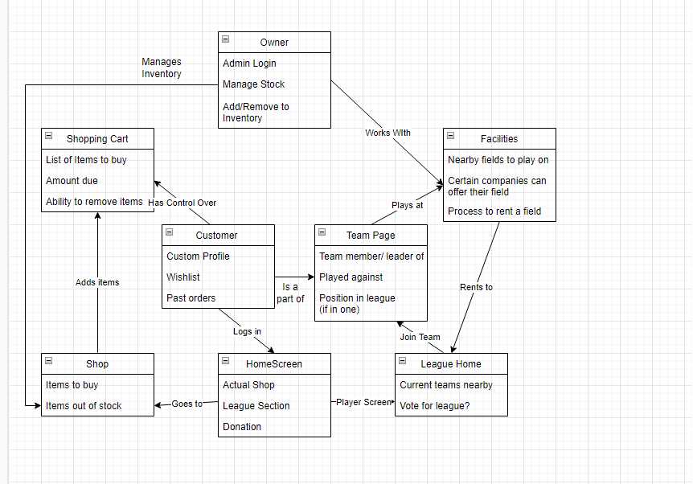
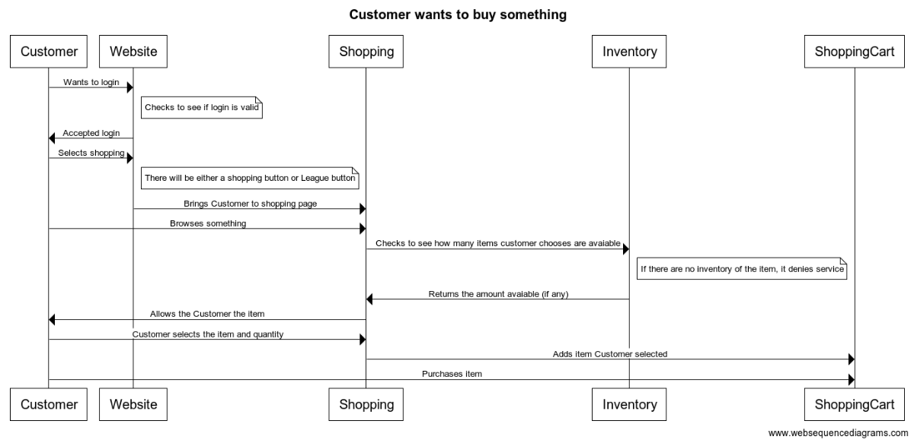
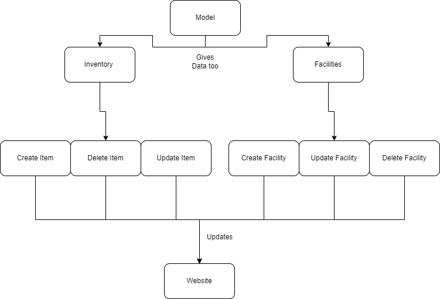
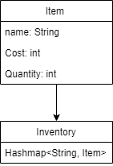
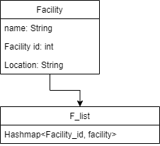

# PROJECT Design Documentation

> _The following template provides the headings for your Design
> Documentation.  As you edit each section make sure you remove these
> commentary 'blockquotes'; the lines that start with a > character
> and appear in the generated PDF in italics._

## Team Information
* Team name: CTN
* Team members
  * Justin Talbot
  * Justin Wade
  * Caden Franklin
  * Kalen Luraschi

## Executive Summary

Team CTN will create a Team Sport Website. Users will be able to buy sports equipment along with joining a team. These teams will then be able to rent out facilities on the facilities page. 
This website is meant to help those who are interested in sports get a headstart in their careers.
### Purpose
> _Sports Dorks allows a user to buy items along with reserving facilities for sports games. Users will be able to look for items, add items into a cart, along with removing items from a cart. Team managers will be able to see facilities available._

### Glossary and Acronyms
> _Provide a table of terms and acronyms._

| Term | Definition |
|------|------------|
| SPA | Single Page |

## Requirements

> _The ability to see and control the inventory (add, remove, edit) along with adding items into a cart. Facilities will be able to 
(add, remove, edit) and allow the user to search for a specific facility._

### Definition of MVP
> _Minimum Viable Product is having a website with the ability to look for inventory items and seeing what facilities are available. Users will be able to see and add items into a cart, and facilities will be able to see what is available._

### MVP Features
> _Search, update, delete and get entire inventory. Add and remove items from shopping cart. Search, update, delete, and get facilities list_

### Roadmap of Enhancements
> _
  1. Create, edit, delete product.
  2. Create inventory list to hold products
  3. Create, edit, delete facilities.
  4. Create facilities list to hold products
  5. Create shopping cart to hold products customers want.
  _

## Application Domain

This section describes the application domain.

The owner of the website is able to control what facilities and what items are in stock. Customers are able to go either browse the shop or browse the team page.
From there they are able to buy sports equipment along with seeing what teams are open for new players. Everyone is able to see the facilities page but only a Team
manager is able to reserve a facilities. The facilities page is a group of facilities that companies offered for others to rent out. Each facility has their own process to rent out a field.

## Architecture and Design

This section describes the application architecture.
### Summary

The following Tiers/Layers model shows a high-level view of the webapp's architecture.

The e-store web application, is built using the Model–View–ViewModel (MVVM) architecture pattern. 

The Model stores the application data objects including any functionality to provide persistance. 

The View is the client-side SPA built with Angular utilizing HTML, CSS and TypeScript. The ViewModel provides RESTful APIs to the client (View) as well as any logic required to manipulate the data objects from the Model.

Both the ViewModel and Model are built using Java and Spring Framework. Details of the components within these tiers are supplied below.

### Overview of User Interface

This section describes the web interface flow; this is how the user views and interacts
with the e-store application.

The user first begins at the homepage with the options to go shopping or search for facilities. If they decide to go shopping they are taken to the inventory page where they can add items into a cart for them to eventually buy. If they decide to take the facilities route, they will be taken to the facilities page where they will be able to look at a list of facilities, search for a specific facility and view any specific details about the facilities.

### View Tier

Facilities page work similarily. When taken to the facilities page, they are given a list of facilities and when clicked on will give a description of it.

### ViewModel Tier
> _Provide a summary of this tier of your architecture. This
> section will follow the same instructions that are given for the View
> Tier above._

> _At appropriate places as part of this narrative provide one or more
> static models (UML class diagrams) with some details such as critical attributes and methods._

The controllers control the data that the persistance contains. Both inventory and facilities work similar as in both use a inventory system. There are interactions the website has, like pressing buttons that command the control the model. From there the website is updated, and so is the api that records the data for the website.

### Model Tier
> _Provide a summary of this tier of your architecture. This
> section will follow the same instructions that are given for the View
> Tier above._

> _At appropriate places as part of this narrative provide one or more
> static models (UML class diagrams) with some details such as critical attributes and methods._

The model is a very simple class set up. Each item has a name, cost, and quantity. Each attribute has a getter and setter for easy updating. After an item is created, they are put into a inventory hashmap. The key is the name of the item, and the value is the item itself.

Facilities works very similarly. Each facility has a name, id, and location. Each attribute has a getter and setter for easy updating. After a facility is created, they are put into a f_list(Facility List) hashmap. The key is the id of the faciliity and the value is the facility itself.

### Static Code Analysis/Design Improvements
> _Discuss design improvements that you would make if the project were
> to continue. These improvement should be based on your direct
> analysis of where there are problems in the code base which could be
> addressed with design changes, and describe those suggested design
> improvements._

> _With the results from the Static Code Analysis exercise, 
> discuss the resulting issues/metrics measurements along with your analysis
> and recommendations for further improvements. Where relevant, include 
> screenshots from the tool and/or corresponding source code that was flagged._

## Testing
> _This section will provide information about the testing performed
> and the results of the testing._

### Acceptance Testing
> _Report on the number of user stories that have passed all their
> acceptance criteria tests, the number that have some acceptance
> criteria tests failing, and the number of user stories that
> have not had any testing yet. Highlight the issues found during
> acceptance testing and if there are any concerns._

> _Most of the user stories were passed and some of the more advanced one were not. The essentials, like creating an inventory and facilities along with basic function of both were added and testing. The more advanced stuff we worked on is still very broken and probably won't see the light of day.

### Unit Testing and Code Coverage
> _Discuss your unit testing strategy. Report on the code coverage
> achieved from unit testing of the code base. Discuss the team's
> coverage targets, why you selected those values, and how well your
> code coverage met your targets. If there are any anomalies, discuss
> those._

> _Most of the code we wrote were based of other components of the project. Therefore, we tested to make sure that the code worked properly.
> This included getting the right numbers, returning the right errors if necessary. We focued on making sure the code was functional and we 
> handled it pretty well. Below you can see our code coverage.

