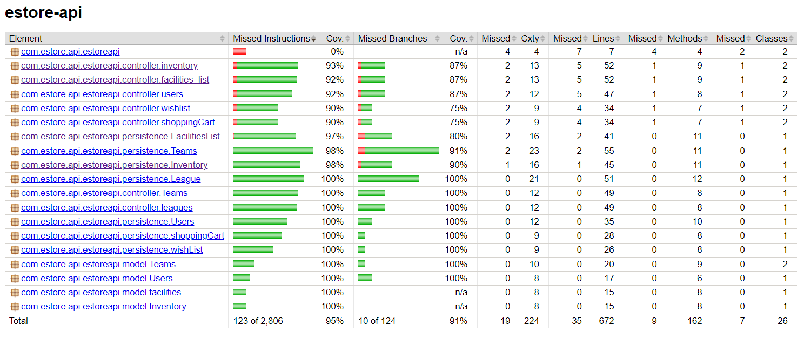

# PROJECT Design Documentation

> _The following template provides the headings for your Design
> Documentation.  As you edit each section make sure you remove these
> commentary 'blockquotes'; the lines that start with a > character
> and appear in the generated PDF in italics._

## Team Information
* Team name: CTN
* Team members
  * Justin Talbot
  * Justin Wade
  * Caden Franklin
  * Kalen Luraschi

## Executive Summary

Team CTN will create a Team Sport Website. Users will be able to buy sports equipment along with joining a team. These teams will then be able to rent out facilities on the facilities page. 
This website is meant to help those who are interested in sports get a headstart in their careers.
### Purpose
Sports Dorks allows a user to buy items along with reserving facilities for sports games. Users will be able to look for items, add items into a cart, along with removing items from a cart. Team managers will be able to see facilities available.

### Glossary and Acronyms
> _Provide a table of terms and acronyms._

| Term | Definition |
|------|------------|
| SPA | Single Page |

## Requirements

The ability to see and control the inventory (add, remove, edit) along with adding items into a cart. Facilities will be able to 
(add, remove, edit) and allow the user to search for a specific facility.

### Definition of MVP
Minimum Viable Product is having a website with the ability to look for inventory items and seeing what facilities are available. Users will be able to see and add items into a cart, and facilities will be able to see what is available.

### MVP Features
Search, update, delete and get entire inventory. Add and remove items from shopping cart. Search, update, delete, and get facilities list

### Roadmap of Enhancements
  1. Create, edit, delete product.
  2. Create inventory list to hold products
  3. Create, edit, delete facilities.
  4. Create facilities list to hold products
  5. Create shopping cart to hold products customers want.
  

## Application Domain

This section describes the application domain.

The owner of the website is able to control what facilities and what items are in stock. Customers are able to go either browse the shop or browse the team page.
From there they are able to buy sports equipment along with seeing what teams are open for new players. Everyone is able to see the facilities page but only a Team
manager is able to reserve a facilities. The facilities page is a group of facilities that companies offered for others to rent out. Each facility has their own process to rent out a field.

## Architecture and Design

This section describes the application architecture.

### Design Principals
Dependency inversion:

>_Critical for doing unit testing since we can inject test/mock objects. This was used for the tests with the mock*insertfilehere*dao. We were able to create mockDAO for testing.

Single Responsibility:

>_Both inventory and facilities use single responsibility, they run on a inventory system meaning that they have different classes for different functions. They each have a controller, model, and persistence that each have their own functions.

Open/Close Principle:

>_ By creating interfaces like InventoryDAO, we can create new classes that interact inventoryDAO without affect any other classes. We can use this to create for example a database that consists of all the things in the inventory. From there we can inject it into other classes so instead of interacting with json, it can interact with the database

### Summary

The following Tiers/Layers model shows a high-level view of the webapp's architecture.

The e-store web application, is built using the Model–View–ViewModel (MVVM) architecture pattern. 

The Model stores the application data objects including any functionality to provide persistance. 

The View is the client-side SPA built with Angular utilizing HTML, CSS and TypeScript. The ViewModel provides RESTful APIs to the client (View) as well as any logic required to manipulate the data objects from the Model.

Both the ViewModel and Model are built using Java and Spring Framework. Details of the components within these tiers are supplied below.

### Overview of User Interface

This section describes the web interface flow; this is how the user views and interacts
with the e-store application.

The user first begins at the homepage with the options to go shopping or search for facilities. If they decide to go shopping they are taken to the inventory page where they can add items into a cart for them to eventually buy. If they decide to take the facilities route, they will be taken to the facilities page where they will be able to look at a list of facilities, search for a specific facility and view any specific details about the facilities.

### View Tier

Facilities page work similarily. When taken to the facilities page, they are given a list of facilities and when clicked on will give a description of it.

When going to either the league or team page, all the players in said league or team will be shown. In the league page each team will be separated and each individual team roster shown.

### ViewModel Tier

The controllers control the data that the persistance contains. Both inventory and facilities work similar as in both use a inventory system. There are interactions the website has, like pressing buttons that command the control the model. From there the website is updated, and so is the api that records the data for the website.

The model can update the view of the teams by adding or removing players as well as adding or removing teams. 

### Model Tier

The model is a very simple class set up. Each item has a name, cost, and quantity. Each attribute has a getter and setter for easy updating. After an item is created, they are put into a inventory hashmap. The key is the name of the item, and the value is the item itself.

Facilities works very similarly. Each facility has a name, id, and location. Each attribute has a getter and setter for easy updating. After a facility is created, they are put into a f_list(Facility List) hashmap. The key is the id of the faciliity and the value is the facility itself.

These were all included together in the same UML diagram since they build off of each other. A team consists of a roster of players and a league consists of a list of teams. A team can get the details of all players in the roster and a league can get all the details of every team in the league.

### Static Code Analysis/Design Improvements

If the project were to continue, we would add additional functions like reserving a facility and having a better front end. Having a wishlist was also one of our plans that we ran out of time to implement. 

Any further improvements regarding the static code analysis would be to manage time better and to understand what you are given. We did not need to make this the best website and we got a big carried away with adding more features than necessary.

Any further improvements regarding the static code analysis would be to manage time better and to understand what you are given. We did not need to make this the best website and we got a big carried away with adding more features than necessary. Another thing we would like to do is improve our code to prevent "smelly code".

The more we were coding, while we didn't have many vulnerabilities, the code started to smell really bad. This is likely because instead of deleting code that is not being used, we comment it out. 

## Testing
> _This section will provide information about the testing performed
> and the results of the testing._

### Acceptance Testing
Most of the user stories were passed and some of the more advanced one were not. The essentials, like creating an inventory and facilities along with basic function of both were added and testing. The more advanced stuff we worked on is still very broken and probably won't see the light of day.

### Unit Testing and Code Coverage
Most of the code we wrote were based of other components of the project. Therefore, we tested to make sure that the code worked properly.
This included getting the right numbers, returning the right errors if necessary. We focued on making sure the code was functional and we 
handled it pretty well. Below you can see our code coverage.

